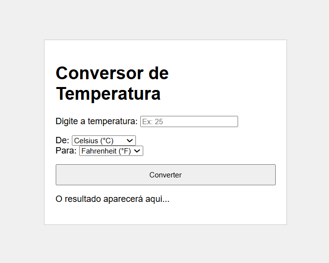
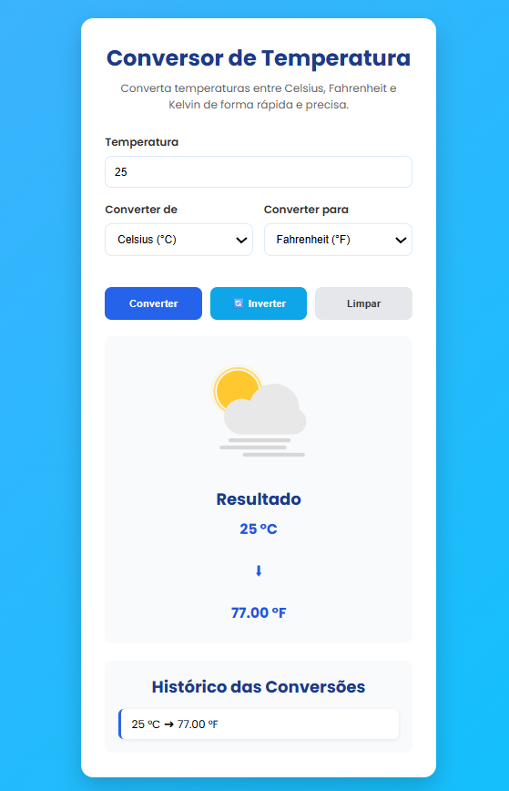
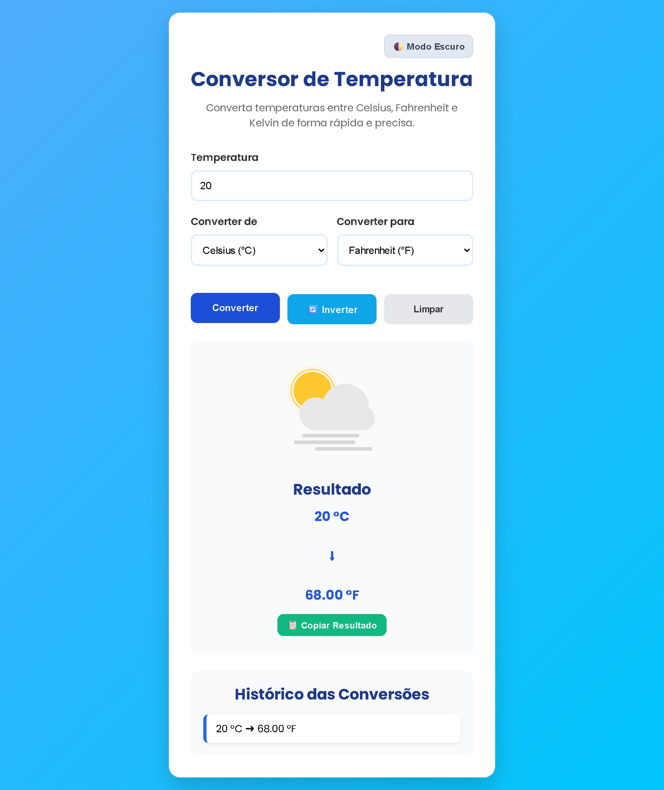

# 🌡️ Conversor de Temperatura

Projeto desenvolvido para a disciplina de Desenvolvimento Colaborativo utilizando Git e GitHub.

O sistema permite realizar conversões entre as escalas Celsius (°C), Fahrenheit (°F) e Kelvin (K), de forma rápida, intuitiva e responsiva.

---

## 👥 Integrantes

| Nome                        | GitHub            |
| --------------------------- | ----------------- |
| Caio Lelys Queiroz Pereira  | @CaLe-09          |
| Jamiryan de Lima Calisto    | @Jamiryan         |
| Kayane Barbosa Araújo       | @bkayane89        |
| David Beckham Paulo Marinho | @DavidMarinho2203 |

---

## 🚀 Funcionalidades

- Conversão entre Celsius, Fahrenheit e Kelvin.
- Validação de campos obrigatórios.
- Validação para impedir Kelvin negativo.
- Botão para inverter as unidades de conversão.
- Botão para limpar todos os campos.
- Conversão utilizando a tecla **Enter**.
- Histórico das últimas conversões realizadas.
- Interface responsiva.
- Animações diferentes conforme a temperatura informada (Frio, Ameno e Calor).

---

## 🛠️ Tecnologias utilizadas

- HTML5
- CSS3
- JavaScript
- Git
- GitHub
- Lottie Web (animações)

---

# 📦 Versionamento

## ✅ Versão 1.0

Primeira versão funcional do projeto.

Características:

- Conversão entre Celsius, Fahrenheit e Kelvin;
- Interface simples;
- Funcionalidade completa;
- Layout básico.

---

## 🚀 Versão 2.0

Foram realizadas melhorias na aparência e na experiência do usuário.

Melhorias implementadas:

- Interface totalmente reformulada;
- Layout moderno;
- Melhor responsividade para dispositivos móveis;
- Melhor organização dos componentes;
- Botão para inverter unidades;
- Botão limpar;
- Histórico das últimas conversões;
- Validações de entrada;
- Mensagens de erro mais claras;
- Conversão pelo teclado (Enter);
- Animações dinâmicas conforme a temperatura.

---

## 🚀 Versão 3.0

Nesta versão, o foco foi trazer recursos avançados de acessibilidade, utilidade e conveniência para o usuário.

Melhorias implementadas:

- Alternância completa de cores do sistema para tons escuros, reduzindo a fadiga visual;
- O sistema utiliza "localStorage" para lembrar se o usuário prefere o modo claro ou escuro, mesmo após fechar o navegador;
- Adicionado um recurso rápido para copiar a temperatura final formatada para a área de transferência com apenas um clique.

---

## 📱 Responsividade

O sistema adapta automaticamente seu layout para computadores, tablets e smartphones.

---

## 📸 Demonstração

### Versão 1.0



### Versão 2.0



---

### Versão 3.0

## 

## ▶️ Como executar

1. Clone o repositório:

```bash
git clone https://github.com/CaLe-09/caiojami-temp-converter.git
```

2. Abra a pasta do projeto.

3. Execute o arquivo `index.html` em qualquer navegador.

---

## 📄 Licença

Projeto desenvolvido exclusivamente para fins acadêmicos.
